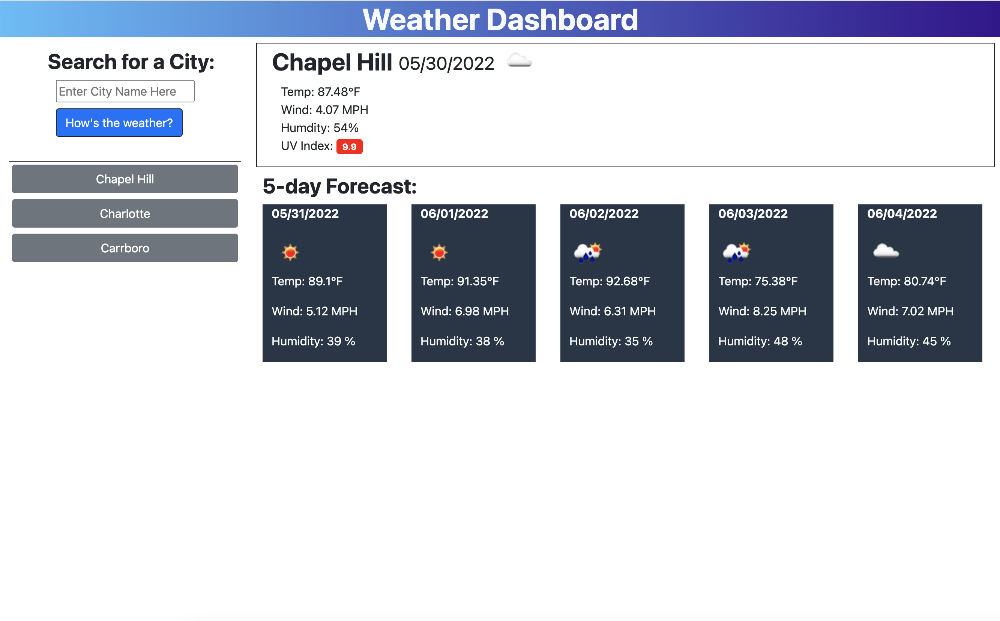

# Weather Dashboard

url: https://roo116.github.io/weather-dashboard/

Welcome to the Weather Dashboard.

This application uses Open Weather Map API's to display current weather conditions, and a five day forecast based on user input.

Enter a city name and click the `How's the weather?` button.

In addition the site will add buttons of recent searches for frequently visited locations!

Here is a sample of the output:


## known issues

On load there is no data in the web-page, and the page only populates when information is entered. Solution would be to use geolocation data to automatically fill that on load. Planned for next release.

## User Story

```
AS A traveler
I WANT to see the weather outlook for multiple cities
SO THAT I can plan a trip accordingly
```

## Acceptance Criteria

```
GIVEN a weather dashboard with form inputs
WHEN I search for a city
THEN I am presented with current and future conditions for that city and that city is added to the search history
WHEN I view current weather conditions for that city
THEN I am presented with the city name, the date, an icon representation of weather conditions, the temperature, the humidity, the wind speed, and the UV index
WHEN I view the UV index
THEN I am presented with a color that indicates whether the conditions are favorable, moderate, or severe
WHEN I view future weather conditions for that city
THEN I am presented with a 5-day forecast that displays the date, an icon representation of weather conditions, the temperature, the wind speed, and the humidity
WHEN I click on a city in the search history
THEN I am again presented with current and future conditions for that city
```
